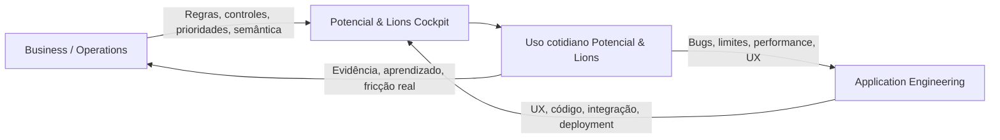
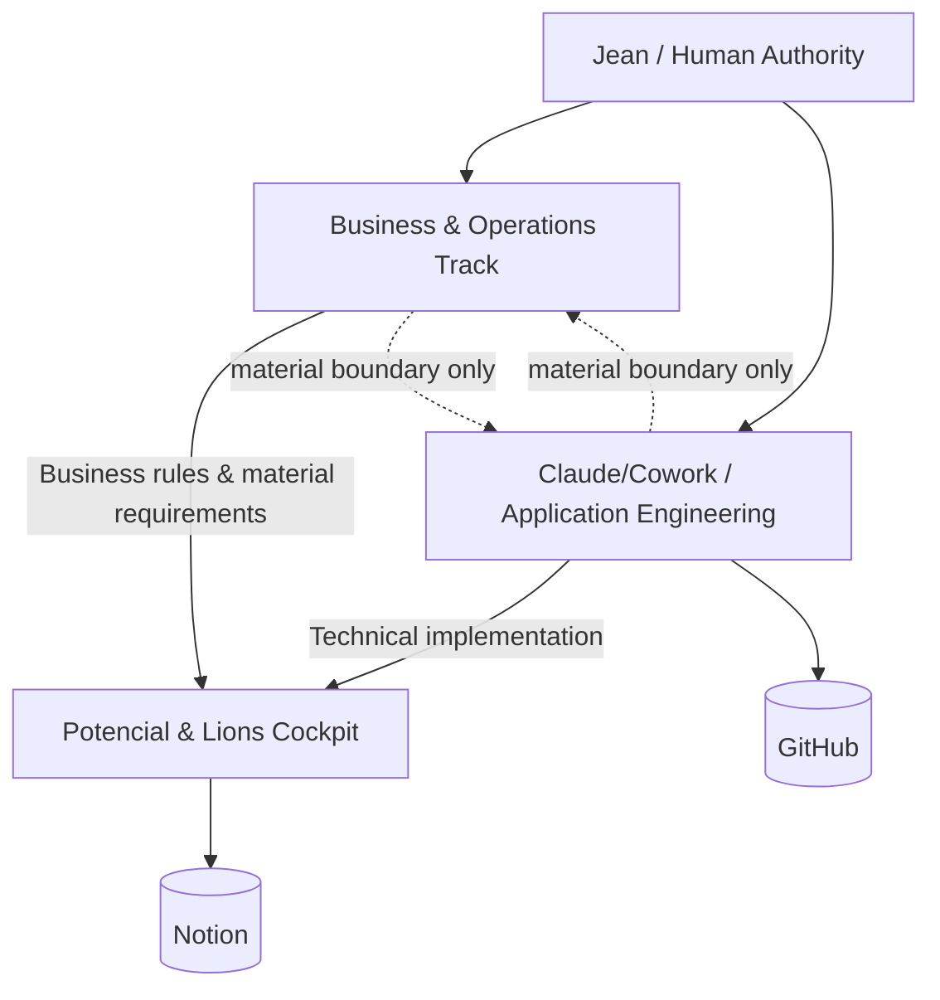
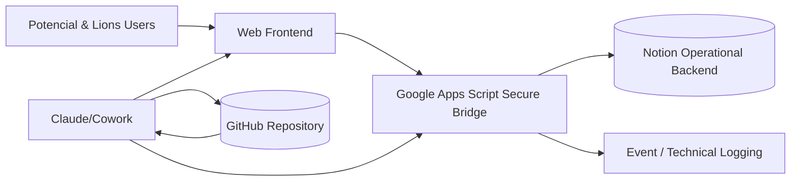
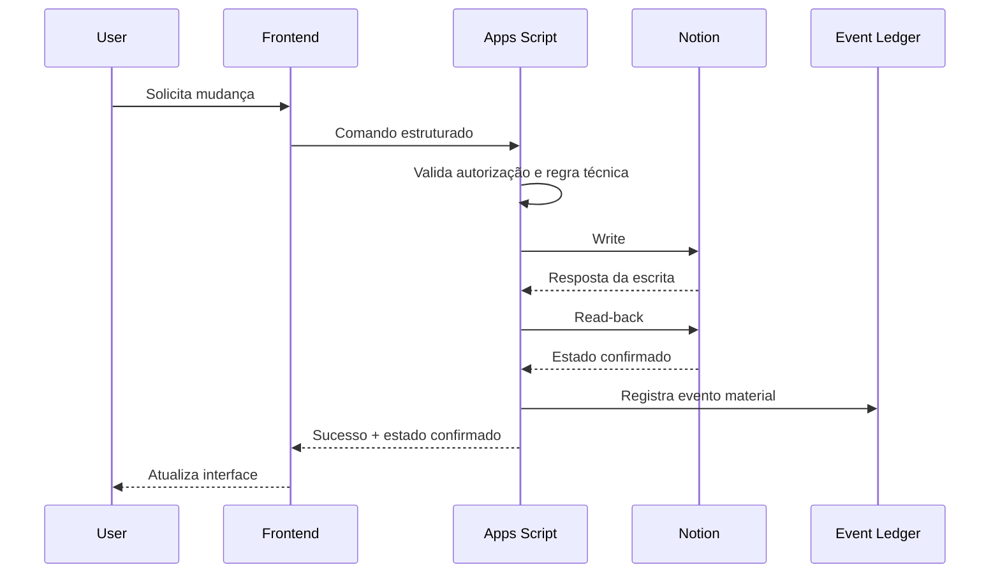
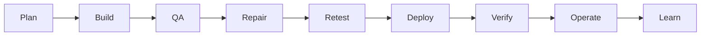

# Relatório Técnico Integral — Potencial & Lions | Partnership Cockpit

**Documento canônico de constituição técnica e operacional**  
**Destinatário principal:** Claude/Cowork — Application Engineering  
**Autoridade humana:** Jean  
**Identidade institucional da parceria:** Potencial & Lions  
**Data de baseline:** 2026-09-21  
**Status:** BASELINE DE IMPLEMENTAÇÃO / SUJEITO A EVOLUÇÃO POR DELTAS MATERIAIS APROVADOS

---

## 1. Identificação, objetivo e escopo

Este relatório estabelece, de forma autossuficiente, o contexto, a origem, a arquitetura, a missão, as responsabilidades, os requisitos e os gates de execução do **Potencial & Lions | Partnership Cockpit**. Ele existe para que Claude/Cowork possa assumir a engenharia da aplicação sem depender de explicações administrativas, reconstrução de conversa anterior ou interpretação informal da origem do projeto.

O Cockpit é uma ferramenta operacional destinada a transformar a parceria Potencial & Lions em uma operação cotidiana acompanhável, acionável, auditável e evolutiva. O objetivo não é criar um dashboard decorativo nem um software isolado da realidade. A aplicação deve materializar controles empresariais reais e permitir que pessoas da Potencial e da Lions conduzam tarefas, frentes, decisões, gates e prioridades de modo simples e persistente.

Este documento também constitui o **contrato de fronteira entre duas trilhas autônomas de trabalho**:

- **Business/Operations Track:** desenvolve os controles, regras, semântica, prioridades e inteligência da parceria. Regras de negócio dependem de aprovação da Human Authority.
- **Application Engineering Track:** sob responsabilidade de Claude/Cowork, com participação direta de Jean, desenvolve e opera tecnicamente a aplicação, a UX, o runtime, a integração, a segurança, os testes, o deployment e a manutenção.

A relação entre as trilhas não é um canal administrativo contínuo. É um modelo de **parallel ownership + material boundary communication**.

---

## 2. Problema de negócio e problema operacional

O problema a resolver não é “como publicar um HTML” nem “como conectar o Notion”. O problema é garantir que uma parceria empresarial tenha controles suficientes para produzir resultado efetivo sem depender de memória individual, mensagens dispersas ou reconstrução manual de contexto.

A parceria necessita de uma superfície única onde seja possível, no cotidiano:

- saber o que importa agora;
- identificar quem precisa agir;
- distinguir execução de decisão;
- visualizar bloqueios e dependências;
- acompanhar frentes;
- registrar progresso e conclusão;
- preservar evidências;
- consultar decisões e gates;
- auditar mudanças materiais;
- operar sobre uma fonte comum de verdade.

O risco principal de projeto é dissociar a ferramenta da vida real. Uma aplicação tecnicamente sofisticada que não representa corretamente a operação é falha. Da mesma forma, controles bem definidos que não chegam a uma ferramenta utilizável também falham.

Por isso, a solução é deliberadamente bimodal:

**Leitura executiva:** o Cockpit existe no encontro de duas responsabilidades independentes. O negócio define o que precisa ser controlado; a engenharia define como isso funciona com qualidade. Nenhuma trilha deve substituir a outra.

---

## 3. Missão e objetivo global

### 3.1 Missão do Cockpit

Construir e operar um sistema cotidiano de coordenação da parceria Potencial & Lions que permita converter decisões, compromissos e frentes em execução observável, com responsabilidade clara, persistência, histórico e capacidade de evolução.

### 3.2 Objetivo de produto

O produto deve reduzir o custo cognitivo e administrativo de operar a parceria. A pessoa deve conseguir entrar no Cockpit e responder, sem reconstrução manual:

1. O que precisa acontecer agora?
2. Quem precisa agir?
3. O que está bloqueado e por quê?
4. O que depende de decisão?
5. O que foi alterado?
6. O que foi concluído?
7. Qual é o próximo passo material?

### 3.3 Critério de sucesso global

O sistema só será considerado bem-sucedido quando coexistirem:

| Dimensão | Condição de sucesso |
|---|---|
| Produto | representa corretamente a realidade operacional |
| Aplicação | funciona de forma estável e segura |
| Uso | pessoas da Potencial e Lions conseguem operar sem suporte constante |
| Persistência | Notion reflete o estado operacional confirmado |
| Auditabilidade | mudanças materiais são recuperáveis |
| Evolução | novos controles entram sem reconstrução integral |
| Baixa fricção | Jean não se torna administrador técnico da ferramenta |
| Resultado | o Cockpit contribui para avanço real da parceria |

---

## 4. Origem e baseline já existente

Já existe um protótipo funcional autônomo em HTML, incluído neste pacote como:

`reference/Cockpit_Potencial_Lions_Sprint1_AtualAte20260921_v1-1.html`

Esse protótipo deve ser tratado como **baseline de UX/produto e referência de comportamento**, não como implementação de produção. Ele possui navegação, visões executivas, fila “Agora”, tarefas, responsáveis, frentes, decisões/gates, deltas e login de demonstração. O estado local do protótipo não é a fonte canônica de produção.

O protótipo contém credenciais de demonstração (`jean/demo`, `marina/demo`) exclusivamente para avaliação local. Essas credenciais não constituem autenticação de produção.

A identidade institucional correta da aplicação é **Potencial & Lions**. Jean e Marina permanecem atores de accountability quando isso for operacionalmente necessário, mas o produto não deve ser apresentado como “Jean + Marina”.

---

## 5. Modelo de autoridade e divisão de responsabilidades

### 5.1 Human Authority

Jean detém a autoridade final sobre:

- regras de negócio;
- semântica dos controles;
- prioridades empresariais;
- decisões materiais da parceria;
- mudança de objetivo ou escopo;
- aprovação de comportamento que altere a operação real.

### 5.2 Business/Operations Track

Responsável por:

- desenvolver controles;
- definir objetos de negócio e seus significados;
- definir estados e critérios;
- estabelecer regras de prioridade;
- desenvolver mecanismos de accountability;
- definir indicadores e visões operacionais;
- registrar decisões de negócio;
- identificar gaps de controle;
- produzir requisitos e mudanças materiais para a aplicação.

### 5.3 Claude/Cowork — Application Engineering

Responsável por:

- arquitetura técnica da aplicação;
- engenharia do frontend;
- UX/UI implementation;
- Google Apps Script;
- integração com Notion;
- autenticação e sessão;
- segurança técnica;
- tratamento de falhas;
- idempotência e concorrência quando aplicável;
- read-back de gravações;
- logs e observabilidade técnica;
- testes;
- deployment;
- debugging;
- refatoração;
- manutenção técnica;
- documentação técnica;
- persistência em GitHub;
- evolução técnica dentro dos boundaries aprovados.

### 5.4 Regra de fronteira

Claude/Cowork **não deve inventar ou alterar regra de negócio**. Se uma limitação técnica tornar uma regra aprovada impossível, insegura ou materialmente diferente, deve isolar a decisão necessária para Jean.

O Business/Operations Track **não deve microgerenciar implementação técnica**. Cowork tem autonomia para decisões de engenharia que não alterem comportamento material aprovado.

### 5.5 Regra contra comunicação administrativa

Não existe obrigação de troca rotineira de mensagens entre IAs. Não criar:

- pedidos de status;
- confirmações de recebimento sem efeito material;
- handoffs administrativos por fase;
- mensagens “continuamos trabalhando”;
- dependência de resposta de outro ambiente para prosseguir em tarefa independente.

A comunicação cross-boundary só ocorre quando altera requisito, regra, infraestrutura, risco, dado, segurança, decisão ou critério de aceite.

**Leitura executiva:** Jean governa as duas trilhas diretamente. Business/Operations e Application Engineering trabalham em paralelo; a linha tracejada indica comunicação apenas quando há efeito material de fronteira.

---

## 6. Arquitetura da solução

A arquitetura de baseline é:

**Leitura executiva:** o browser não deve receber segredo de integração do Notion. Apps Script serve como runtime permanente e camada de mediação. Notion guarda o estado operacional; GitHub guarda o estado técnico/documental.

### 6.1 Frontend

Responsabilidade principal:

- apresentar estado operacional;
- receber interações;
- validar campos básicos;
- oferecer feedback de carregamento/erro;
- nunca afirmar sucesso material antes da confirmação server-side;
- permanecer responsivo e legível em desktop e mobile.

### 6.2 Google Apps Script

Responsabilidade de baseline:

- hospedar/servir o Web App;
- manter secrets/configuração no lado servidor;
- autenticar e autorizar requisições;
- validar comandos;
- acessar Notion;
- executar read/write;
- fazer read-back;
- aplicar idempotência/locking quando necessário;
- registrar eventos técnicos/materialmente relevantes;
- tratar erros sem false success;
- devolver respostas estruturadas ao frontend.

Google documenta que Apps Script pode publicar Web Apps acessíveis por navegador por meio de `doGet(e)` e `doPost(e)` e possui configurações de deployment e identidade de execução. O Properties Service oferece stores de chave/valor em escopos de script, usuário e documento. Esses mecanismos são referências de plataforma, não autorização para armazenar qualquer segredo sem revisão técnica.

### 6.3 Notion

Notion é a **fonte canônica de estado operacional**.

Princípio:

`NOTION = OPERATIONAL TRUTH`

A interface, Apps Script, Cowork ou ChatGPT não substituem esse estado.

### 6.4 GitHub

GitHub é a **fonte persistente de verdade técnica/documental**.

Princípio:

`GITHUB = APPLICATION / TECHNICAL TRUTH`

O repositório deve preservar código, arquivos, revisão histórica, documentação, decisões técnicas, releases, testes e runbooks. Git/GitHub são usados precisamente para versionar arquivos e recuperar histórico de mudanças.

### 6.5 Distinção canônica

| Objeto | Fonte canônica |
|---|---|
| status de uma tarefa | Notion |
| responsável operacional | Notion |
| decisão/gate registrado | Notion |
| código Apps Script | GitHub |
| frontend source | GitHub |
| arquitetura técnica | GitHub |
| regra de negócio aprovada | Business/Operations authority + documentação controlada |
| secret/token | secret store server-side, nunca Git/cliente |

---

## 7. Modelo operacional inicial

A aplicação parte de quatro domínios operacionais principais.

### 7.1 Actions

Representa trabalho executável.

Campos mínimos recomendados:

- Action ID;
- Ação/Título;
- Frente;
- Responsável;
- Prioridade;
- Status;
- Prazo/janela;
- Próximo passo;
- Definition of Done;
- Origem/provenance;
- Evidence Ref;
- Atualizado em;
- Atualizado por.

### 7.2 Fronts

Representa agrupamentos de trabalho relevantes à parceria. Deve permitir visão consolidada sem transformar frente em hierarquia de pessoas.

### 7.3 Decisions & Gates

Representa decisões, dependências decisórias e condições de autoridade que não devem ser confundidas com tarefas comuns.

### 7.4 Event Ledger

Registra mudanças materiais de estado. Não deve ser um log ruidoso de todo clique. Deve permitir reconstruir alterações relevantes.

Eventos materiais típicos:

- mudança de status;
- mudança de prioridade;
- troca de responsável;
- conclusão;
- cancelamento;
- alteração de decisão/gate;
- mudança que impacta evidence/provenance.

---

## 8. Visões funcionais de baseline

O protótipo atual estabelece como mínimo:

1. **Visão Executiva** — fotografia do estado e das pressões operacionais;
2. **Agora** — fila priorizada de ação;
3. **Tarefas** — busca, filtros e detalhamento;
4. **Responsáveis** — distribuição e accountability;
5. **Frentes** — leitura por domínio de trabalho;
6. **Decisões & Gates** — itens que dependem de decisão/condição;
7. **Deltas pós-baseline** — alterações relevantes posteriores ao conjunto inicial.

Essas visões são produto evolutivo, não estrutura rígida. Cowork pode melhorar UX e composição sem mudar seu significado material.

---

## 9. O mecanismo “Agora”

“Agora” não deve ser tratado como lista manual qualquer. Ele é o motor de atenção cotidiana.

Pergunta operacional:

> Dentre tudo que existe, o que merece atenção agora e por quê?

O algoritmo/regra de priorização pertence ao domínio de Business/Operations e deve permanecer transparente. Cowork implementa a regra aprovada e deve evitar scoring oculto ou inferências não auditáveis que alterem prioridade empresarial.

No baseline de protótipo existe scoring orientativo por prioridade, status, janela e condições. Esse scoring é referência de produto, não regra imutável. Qualquer mudança de pesos, fatores ou semântica deve ser tratada como regra de negócio quando alterar a ordem material de atenção.

---

## 10. Requisitos funcionais

### RF-01 — Autenticação e acesso

A aplicação deve exigir autenticação antes de expor dados operacionais. O mecanismo final pode ser definido tecnicamente por Cowork dentro da arquitetura autorizada, desde que não exponha secrets e permita controle de acesso adequado.

### RF-02 — Snapshot inicial

Ao abrir, a aplicação deve carregar do backend o estado atual necessário para as visões principais. Não utilizar estado local antigo como verdade de produção.

### RF-03 — Busca e filtros

Usuários devem conseguir pesquisar e filtrar ações por campos relevantes, pelo menos status, prioridade, responsável, frente e origem quando disponível.

### RF-04 — Detalhe

Cada item deve oferecer detalhe suficiente para compreender ação, responsável, estado, frente, prazo/janela, DoD, origem e evidência quando aplicável.

### RF-05 — Atualização material

Mudanças permitidas devem ser enviadas ao backend, persistidas em Notion e confirmadas por read-back antes de feedback de sucesso.

### RF-06 — Criação

A aplicação deve permitir criação de novos itens operacionais conforme as regras aprovadas e campos obrigatórios.

### RF-07 — Decisões/Gates

Itens decisórios devem permanecer distinguíveis de tarefas comuns e possuir comportamento coerente com sua autoridade.

### RF-08 — Event Ledger

Mudanças materiais devem gerar evento auditável.

### RF-09 — Erros honestos

Falha de rede, autorização, validação, Notion ou concorrência não pode ser apresentada como sucesso.

### RF-10 — Responsividade

As funções essenciais devem permanecer operáveis em desktop e mobile.

---

## 11. Requisitos não funcionais

| ID | Requisito |
|---|---|
| RNF-01 | baixa fricção de uso cotidiano |
| RNF-02 | nenhuma dependência de segredo no cliente |
| RNF-03 | GitHub como persistência técnica obrigatória |
| RNF-04 | recuperação possível sem transcript do Cowork |
| RNF-05 | estados e erros semanticamente claros |
| RNF-06 | nenhuma confirmação de sucesso sem read-back material |
| RNF-07 | legibilidade e responsividade |
| RNF-08 | arquitetura evolutiva sem overengineering |
| RNF-09 | observabilidade suficiente para diagnosticar falhas |
| RNF-10 | documentação técnica atualizada junto a mudanças materiais |
| RNF-11 | proteção contra duplicidade/replay quando material |
| RNF-12 | nenhuma regra de negócio implícita escondida no frontend |

---

## 12. Contrato de persistência e confirmação

Fluxo obrigatório de mudança material:

**Leitura executiva:** sucesso é consequência de estado confirmado, não de clique nem de resposta otimista do frontend. Se o read-back falhar, o sistema deve informar estado incerto/erro e evitar false success.

---

## 13. Autenticação, autorização e segurança

O pacote de produção deve respeitar, no mínimo:

- tokens do Notion nunca no HTML/JS cliente;
- nenhuma senha real versionada no GitHub;
- secrets fora do repositório;
- validação server-side;
- autorização aplicada a cada operação material, não apenas na tela de login;
- sessões com expiração adequada ao mecanismo escolhido;
- logout real;
- proteção razoável contra tentativa repetida e replay conforme risco;
- logs sem vazamento de credenciais;
- mensagens de erro que não exponham secrets;
- menor privilégio possível para integrações;
- revisão de acesso antes de produção.

As credenciais `jean/demo` e `marina/demo` pertencem exclusivamente ao protótipo local e devem ser removidas da versão de produção.

---

## 14. UX e linguagem operacional

A UX deve ser construída pelo ponto de vista da operação da parceria, não pelo ponto de vista das tabelas do banco.

Hierarquia cognitiva desejada:

1. o que importa agora;
2. o que está bloqueado;
3. quem precisa agir;
4. o que depende de decisão;
5. o que acontece depois.

Princípios:

- reduzir cliques para ações recorrentes;
- evitar telas que apenas espelham schemas;
- estados devem ser reconhecíveis sem depender exclusivamente de cor;
- erros e carregamentos devem ser visíveis;
- filtros devem preservar contexto;
- detalhe deve permitir ação, não apenas leitura;
- mobile deve preservar funções essenciais;
- ações destrutivas exigem confirmação proporcional;
- mudanças sensíveis devem mostrar resultado confirmado.

Cowork possui autonomia de implementação visual. Mudanças que alterem significado, prioridade, autoridade ou regra de negócio devem retornar ao boundary apropriado.

---

## 15. GitHub como requisito de continuidade

Toda documentação técnica relevante deve estar persistida no GitHub junto ao código. O objetivo não é burocracia documental; é garantir que a aplicação possa ser compreendida, recuperada, auditada e mantida independentemente de um transcript específico.

O repositório deve permitir que um sucessor técnico responda:

- qual é a missão;
- como a arquitetura funciona;
- como configurar ambiente;
- como testar;
- como implantar;
- como recuperar;
- quais regras técnicas existem;
- quais decisões arquiteturais foram tomadas;
- quais mudanças foram feitas e por quê.

GitHub não deve armazenar secrets.

---

## 16. Modelo de Sprint e execução

A unidade de execução é a Sprint, não cada fase interna.

Uma Sprint pode incluir, sem microaprovação intermediária:

**Leitura executiva:** fases internas não geram checkpoints administrativos. A Sprint só deve interromper por boundary material de autoridade, segurança, irreversibilidade, escopo ou impossibilidade técnica real.

### 16.1 Anti-fragmentação

Não transformar pesquisa, build, QA, deploy e read-back em Sprints separados quando fazem parte do mesmo incremento utilizável.

### 16.2 Definition of Done da Sprint técnica

Uma Sprint de Application Engineering está concluída quando o incremento:

- está implementado;
- foi testado;
- falhas materiais encontradas foram tratadas ou registradas;
- documentação técnica correspondente foi atualizada;
- código está persistido no GitHub;
- deployment/ambiente aplicável foi verificado;
- não existe false success conhecido;
- regras de negócio permanecem aderentes ao baseline aprovado.

---

## 17. Protocolo de mudança entre as trilhas

As trilhas não trocam mensagens administrativas. Uma comunicação só deve ocorrer quando há **material cross-boundary effect**.

### 17.1 Business → Technical

Um objeto de mudança deve conter:

- Change ID;
- objeto afetado;
- motivo;
- comportamento anterior;
- novo comportamento aprovado;
- impacto de dados;
- impacto de UX quando conhecido;
- compatibilidade/migração;
- critérios de aceite;
- prioridade;
- aprovação/provenance.

### 17.2 Technical → Business

Escalar somente quando um fato técnico exigir decisão de negócio. Exemplo:

- limitação da plataforma altera regra;
- requisito de segurança muda responsabilidade do usuário;
- restrição de dados elimina auditabilidade;
- autenticação disponível muda população de acesso;
- simplificação proposta removeria um controle material.

A escalada deve conter a decisão necessária, não um relatório administrativo de progresso.

---

## 18. Plano inicial para Cowork

### Sprint técnica inicial — Constituição e produção do primeiro incremento conectado

**Objetivo:** transformar o protótipo aprovado em uma aplicação tecnicamente versionada, conectável ao Notion, servida por Apps Script e preparada para uso operacional seguro.

Fases internas sugeridas, dentro da mesma Sprint:

1. **Reconciliação:** ler integralmente este pacote e o HTML de referência; mapear comportamento existente.
2. **Repository Baseline:** criar/organizar repositório GitHub e persistir documentação técnica.
3. **Technical Architecture:** fechar a arquitetura real de Apps Script + Notion + frontend sem alterar regras de negócio.
4. **Notion Model:** implementar ou reconciliar o schema necessário para Actions, Fronts, Decisions/Gates e Event Ledger.
5. **Secure Bridge:** implementar autenticação/autorização e acesso server-side ao Notion.
6. **Frontend Integration:** substituir estado de demonstração por snapshot e operações reais.
7. **Write/Read-back/Ledger:** implementar contrato de persistência.
8. **QA:** executar testes de autenticação, leitura, escrita, erro, idempotência e responsividade.
9. **Deployment:** publicar no Apps Script quando as permissões humanas necessárias estiverem disponíveis.
10. **Verification:** validar URL, acesso, persistência e documentação no GitHub.

Jean participa diretamente da execução no Cowork. Não é necessário produzir mensagens administrativas para o Business/Operations Track durante a Sprint.

---

## 19. Critérios de aceite iniciais

### AC-01 — Autenticação

**Dado** usuário não autenticado  
**Quando** tenta acessar dados operacionais  
**Então** não recebe snapshot nem funções protegidas.

### AC-02 — Snapshot canônico

**Dado** usuário autorizado  
**Quando** abre a aplicação  
**Então** os dados exibidos derivam do estado atual do Notion e não de `localStorage` de demonstração.

### AC-03 — Mudança de status

**Dado** uma Action em estado permitido  
**Quando** usuário autorizado altera o status  
**Então** a mudança é escrita no Notion, relida, confirmada e refletida na UI.

### AC-04 — Falha de persistência

**Dado** erro de escrita ou read-back  
**Quando** uma mudança é solicitada  
**Então** a UI não apresenta sucesso e mostra erro/estado incerto de forma clara.

### AC-05 — Event Ledger

**Dado** mudança material bem-sucedida  
**Quando** o estado é confirmado  
**Então** evento correspondente é persistido com objeto, mudança, ator e timestamp conforme o modelo aprovado.

### AC-06 — GitHub

**Dado** uma release técnica material  
**Quando** é considerada pronta  
**Então** código e documentação técnica correspondente estão persistidos no repositório, sem secrets.

### AC-07 — Mobile

**Dado** viewport mobile  
**Quando** usuário navega e atualiza item  
**Então** funções essenciais permanecem legíveis e operáveis sem overflow impeditivo.

---

## 20. Riscos e gaps conhecidos

### 20.1 Autenticação final

O protótipo usa login de demonstração. O mecanismo de produção precisa ser fechado e implementado no Cowork. A escolha técnica deve preservar simplicidade e segurança sem inventar processo empresarial desnecessário.

### 20.2 Schema final do Notion

O modelo conceitual está definido, mas o schema físico deve ser reconciliado com o backend escolhido e com qualquer estrutura já existente. Alteração de significado de campo é mudança de negócio; alteração puramente técnica de schema é responsabilidade de engenharia.

### 20.3 Limites e quotas de plataforma

Apps Script e Notion possuem limites e quotas. Cowork deve verificar as condições atuais das contas e projetar de forma proporcional ao uso real antes de adicionar infraestrutura.

### 20.4 Concorrência e idempotência

O nível de proteção necessário deve ser implementado com base nos fluxos reais. Operações críticas devem evitar duplicidade e estado divergente.

### 20.5 Evidência operacional

A estratégia final de `Evidence Ref` deve ser suficientemente simples para uso cotidiano e suficientemente robusta para reconstruir conclusões quando necessário.

---

## 21. Alternativas e trade-offs já resolvidos

### 21.1 Apps Script vs. backend próprio

Baseline escolhido: Apps Script, por reduzir infraestrutura nova e aproveitar ambiente Google existente. Cowork pode recomendar mudança futura somente se existir benefício material comprovado e sem alterar regras de negócio sem aprovação.

### 21.2 Site externo vs. somente ChatGPT

A parceria será profissionalizada com uma aplicação própria de uso cotidiano. ChatGPT pode continuar como ferramenta de Business/Operations, mas não substitui a superfície operacional persistente.

### 21.3 GitHub vs. transcript

GitHub é obrigatório. Transcript de Cowork não é repositório técnico.

### 21.4 Inter-AI coordination vs. independent ownership

Escolhido: independent ownership. Evitar mensagens administrativas entre agentes.

---

## 22. Fontes oficiais de plataforma utilizadas

### Anthropic

- Cowork Workshop: Foundations — working folders, multi-step delegation, tools, browser/web apps, global instructions, Projects, Skills e Plugins:  
  https://www.anthropic.com/webinars/cowork-workshop-foundations
- How we contain Claude across products — containment model and selected workspace folder for Cowork:  
  https://www.anthropic.com/engineering/how-we-contain-claude
- Introducing Agent Skills — Skills as folders of instructions/scripts/resources:  
  https://www.anthropic.com/research/skills

### Google Apps Script

- Web Apps:  
  https://developers.google.com/apps-script/guides/web
- Properties Service:  
  https://developers.google.com/apps-script/guides/properties

### GitHub

- About repositories:  
  https://docs.github.com/en/repositories/creating-and-managing-repositories/about-repositories
- About Git:  
  https://docs.github.com/en/get-started/using-git/about-git
- Best practices for repositories:  
  https://docs.github.com/en/repositories/creating-and-managing-repositories/best-practices-for-repositories

### Notion

- Developer documentation / API reference:  
  https://developers.notion.com/reference/intro
- Current view/API example with bearer authorization and versioned endpoint:  
  https://developers.notion.com/reference/create-view

---

## 23. Matriz Viso-Cognitiva 19/19

| Elemento | Decisão | Justificativa material | Evidência no artefato |
|---|---|---|---|
| bar-column | NOT_APPLICABLE | não há comparação quantitativa categórica material neste baseline | tabelas preservam correspondências exatas |
| line-area | NOT_APPLICABLE | não há série temporal quantitativa | timeline de execução é melhor representada por fluxo de Sprint |
| scatter | NOT_APPLICABLE | não há associação entre variáveis quantitativas | sem uso |
| waterfall | NOT_APPLICABLE | não há ponte de valores | sem uso |
| radar | NOT_APPLICABLE | não há perfil multivariável comparável | sem uso |
| pie-donut | NOT_APPLICABLE | não há composição quantitativa | sem uso |
| dashboard | NOT_APPLICABLE | o relatório especifica um dashboard, mas não precisa simulá-lo | protótipo HTML é evidence object separado |
| decision-tree | NOT_APPLICABLE | boundaries são melhor explicados por regras e fluxos, sem árvore condicional extensa | seção de autoridade |
| causal-loop | NOT_APPLICABLE | não se deve sugerir causalidade entre governança e resultado sem evidência | sem uso |
| ishikawa | NOT_APPLICABLE | não há investigação de causa raiz | sem uso |
| prioritization-matrix | NOT_APPLICABLE | prioridades de negócio não estão sendo reclassificadas neste relatório | seção “Agora” preserva autoridade |
| flowchart-bpmn | APPLY | relações de fluxo, persistência e Sprint são centrais | diagramas de arquitetura, sequência e Sprint |
| journey-map | NOT_APPLICABLE | não há pesquisa de jornada de usuário suficiente para declarar uma journey | UX descrita por requisitos |
| ecosystem-map | APPLY | é necessário mostrar atores e fontes de verdade sem inventar hierarquia | mapa de autoridade e arquitetura |
| org-chart | NOT_APPLICABLE | a relação entre as trilhas não é hierarquia organizacional formal | evitado deliberadamente |
| timeline | NOT_APPLICABLE | não há cronologia histórica/futura fixa; Sprint é fluxo, não calendário | sem uso |
| gantt | NOT_APPLICABLE | não existem durações ou datas comprometidas para o Cowork | plano por fases internas |
| mind-map | NOT_APPLICABLE | ideação não é o objetivo deste artefato | estrutura textual integral |
| table | APPLY | correspondência precisa entre responsabilidades, fontes de verdade e requisitos | múltiplas tabelas |

**Leitura executiva:** foram aplicados apenas os recursos que reduzem esforço cognitivo sem sugerir precisão, hierarquia, cronologia ou causalidade inexistentes.

---

## 24. Receipt da aplicação do Framework Viso-Cognitivo

- `FRAMEWORK_SOURCE_FILE`: `skills://apresentacao-visual-integral/references/framework-viso-cognitivo-current.md`
- `VERSION`: v1-0
- `UPDATED_THROUGH`: 2026-09-19
- `STATUS`: PORTABLE / INTERPLATFORM / HUMAN-AUTHORITY-APPROVED-FOR-COMPARATIVE-TESTING
- `FRAMEWORK_SOURCE_FULL_READ`: PASS
- `FRAMEWORK_SOURCE_HASH`: não exposto pela interface de leitura da Skill; versão e URI registradas como controle de origem
- `DERIVED_REFERENCES_RECONCILED`: PASS (`report-mode.md`, `qa-release.md`)
- `FRAMEWORK_NON_REDUCTION_GATE`: PASS
- `DELIVERABLE_MODE`: REPORT
- `FRAMEWORK_FULL_EVALUATION`: PASS — 19/19 avaliados
- `INFORMATION_RELATION_RESOLVED`: PASS
- `AUDIENCE_FIT_GATE`: PASS — Claude/Cowork + Jean como público técnico-operacional
- `VISUAL_NEED_GATE`: PASS para arquitetura, persistência e Sprint; outros visuais descartados
- `REPRESENTATION_FIT_GATE`: PASS
- `TEXTUAL_TAKEAWAY_GATE`: PASS
- `PROVENANCE_PRESERVED`: PASS
- `RECOVERABILITY_PASS`: PASS por Markdown canônico + Word + evidence object + manifest
- `CROSS_FORMAT_EQUIVALENCE`: a validar no pipeline de geração/QA do Word antes do release do pacote

---

## 25. Resumo Executivo

O Potencial & Lions | Partnership Cockpit é um sistema operacional cotidiano da parceria, não um dashboard decorativo. A missão é converter compromissos, frentes, decisões, gates e prioridades em execução observável e auditável.

A governança foi deliberadamente dividida. Business/Operations define e evolui controles e regras de negócio sob aprovação de Jean. Claude/Cowork assume Application Engineering com autonomia sobre UX, frontend, Apps Script, Notion integration, segurança, testes, deployment e manutenção técnica. Não existe uma obrigação de comunicação administrativa entre as IAs; as duas trilhas operam em paralelo e só cruzam a fronteira quando há impacto material.

A arquitetura de baseline utiliza frontend web + Google Apps Script como runtime/secure bridge + Notion como fonte canônica do estado operacional. GitHub é obrigatório como fonte persistente do código e da documentação técnica. Secrets não podem aparecer no cliente nem no repositório.

Toda mudança material deve seguir write → read-back → confirmação. O protótipo HTML incluído no pacote representa a direção aprovada de produto, mas não a segurança nem a persistência de produção.

O próximo incremento esperado do Cowork é constituir o repositório, reconciliar o protótipo, implementar o bridge seguro, conectar ao Notion, executar testes, implantar quando autorizado e preservar o estado técnico no GitHub.

---

## 26. CTA / Próximo Passo para Claude/Cowork

**Ação:** assumir a Sprint técnica inicial descrita neste relatório e no arquivo `02_REQUISITOS_E_CRITERIOS_DE_ACEITE.md`.

**Finalidade:** transformar o protótipo em primeiro incremento conectado e recuperável da aplicação Potencial & Lions.

**Executor:** Claude/Cowork com participação direta de Jean.

**Decisão humana necessária:** somente quando surgir boundary real de business rule, autorização de conta, ação irreversível ou mudança material de arquitetura/risco.

**Gate de conclusão:** código e documentação no GitHub; integração Notion funcionando; Apps Script operacional; autenticação e segurança implementadas; write/read-back/ledger testados; UX essencial funcional em desktop/mobile; nenhum secret no cliente/repositório; nenhum false success conhecido.

**Evidência:** repository state + release/deployment verificável + acceptance test record.

